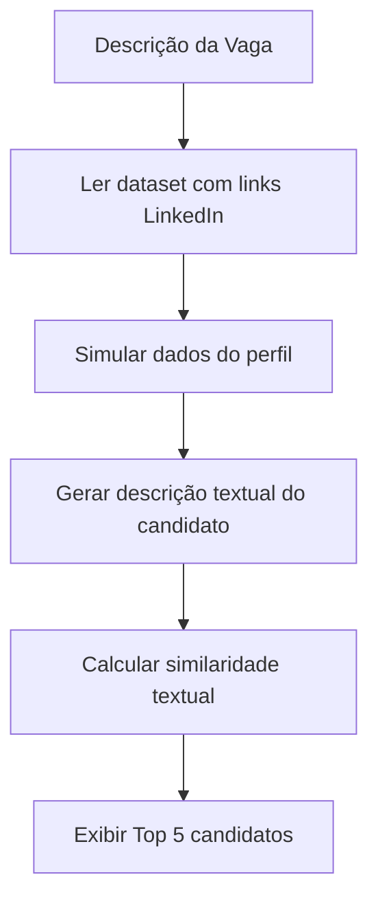

# 🧠 Analisador de Aderência de Perfis LinkedIn® (versão 2)

Este projeto implementa um sistema Web que analisa **links de perfis do LinkedIn®** e calcula a **aderência de cada candidato** a uma vaga de emprego.  
Agora, o dataset contém **apenas os links dos perfis**, e o sistema **simula a leitura dos dados** desses perfis para fins de demonstração (sem violar políticas do LinkedIn).

---

## 📋 Funcionalidades

- Interface Web para descrição da vaga:
  - Grau de escolaridade  
  - Conhecimentos obrigatórios e desejados  
  - Tempo de experiência  
  - Outras observações  

- Leitura de um **dataset contendo apenas os links LinkedIn® dos candidatos**.  
- Simulação de consulta aos dados do perfil (nome, cargo, habilidades).  
- Análise automática da aderência da vaga usando **TF-IDF + Similaridade do Cosseno**.  
- Listagem dos **Top 5 perfis mais aderentes** com:
  - Nome e link para o perfil  
  - Percentual de aderência  
  - Motivo da classificação

---

## ⚙️ Tecnologias Utilizadas

| Camada | Tecnologia | Descrição |
|---------|-------------|------------|
| **Frontend** | HTML5, CSS3, JavaScript | Interface Web |
| **Backend** | Python + Flask | API que processa os dados e faz a análise |
| **Análise de Texto (NLP)** | Scikit-learn (TF-IDF + Cosine Similarity) | Mede a similaridade textual |
| **Dataset** | JSON | Contém apenas os links dos candidatos |

---

## 🧩 Estrutura do Projeto

```
analise-aderencia/
│
├── app.py                   # Backend Flask principal
├── requirements.txt          # Dependências do projeto
│
├── templates/
│   └── index.html            # Página principal (formulário e resultados)
│
├── static/
│   ├── style.css             # Estilos da página
│   └── script.js             # Lógica de interação frontend
│
├── data/
│   └── candidatos.json       # Dataset de links LinkedIn
│
└── README.md
```

---

## 🚀 Como Executar Localmente

### 1️⃣ Clonar o repositório

```bash
git clone https://github.com/seuusuario/analise-aderencia.git
cd analise-aderencia
```

### 2️⃣ Criar um ambiente virtual

```bash
python -m venv venv
source venv/bin/activate     # Linux / macOS
venv\Scripts\activate        # Windows
```

### 3️⃣ Instalar dependências

```bash
pip install -r requirements.txt
```

> Exemplo de `requirements.txt`:
> ```
> Flask
> scikit-learn
> numpy
> ```

### 4️⃣ Executar o servidor Flask

```bash
python app.py
```

O servidor iniciará em:  
👉 [http://localhost:5000](http://localhost:5000)

---

## 📁 Exemplo de Dataset (`data/candidatos.json`)

```json
[
  { "linkedin": "https://www.linkedin.com/in/joaosilva/" },
  { "linkedin": "https://www.linkedin.com/in/mariasouza/" },
  { "linkedin": "https://www.linkedin.com/in/robertocosta/" }
]
```

---

## ⚙️ Simulação de Dados dos Perfis

Como o LinkedIn não permite coleta automatizada, o backend **simula os dados** com base no identificador do link.  
Exemplo de simulação (realizada internamente pelo script):

```python
def obter_dados_linkedin(link):
    nomes_fake = {
        "joaosilva": ("João Silva", "Engenheiro de Software", ["Python", "Flask", "Machine Learning"]),
        "mariasouza": ("Maria Souza", "Desenvolvedora Full Stack", ["React", "Node.js", "AWS"]),
        "robertocosta": ("Roberto Costa", "Cientista de Dados", ["Python", "Pandas", "SQL"])
    }
```
Esses dados são usados para construir descrições de perfil e calcular a aderência com a vaga.

---

## 🧮 Como a Aderência é Calculada

1. A descrição da vaga e os textos simulados dos perfis são vetorizados com **TF-IDF**.  
2. É calculada a **similaridade do cosseno** entre o texto da vaga e cada perfil.  
3. O resultado é convertido em um **percentual de aderência (0–100%)**.  
4. O sistema retorna o **Top 5 candidatos** com explicação do motivo.

Exemplo:
```
João Silva — 91.4% → Compatível com Python, Flask e Machine Learning  
Maria Souza — 82.7% → Forte em Node.js e React  
...
```

---

## 🧠 Fluxo do Sistema



---

## ⚠️ Observação Importante

Este projeto **não realiza scraping real** de perfis do LinkedIn®.  
Todas as consultas são **simuladas localmente** e servem apenas para demonstração acadêmica e técnica.  
Para uso corporativo, é necessário integrar com a **LinkedIn Partner API** (acesso restrito e autorizado).

---

## 🌟 Melhorias Futuras

- Integração com APIs de recrutamento (Gupy, Kenoby, etc.)
- Uso de **embeddings semânticos** para maior precisão (ex: `SentenceTransformers` ou `OpenAI Embeddings`)
- Upload de dataset via interface Web
- Exportação dos resultados em PDF/CSV
- Interface com **gráficos (Chart.js)**

---
